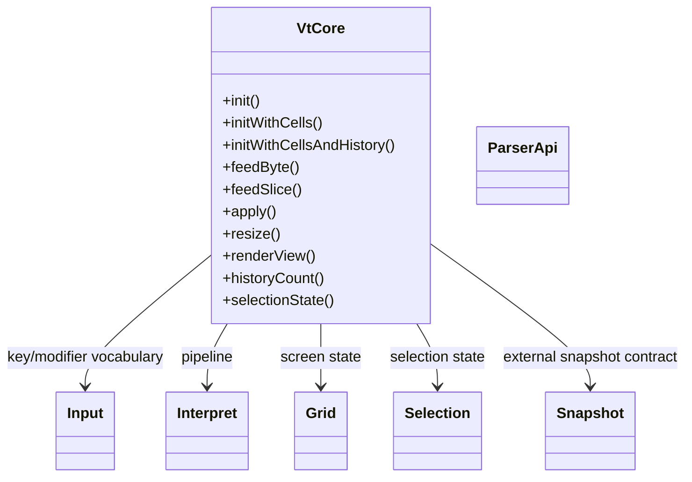
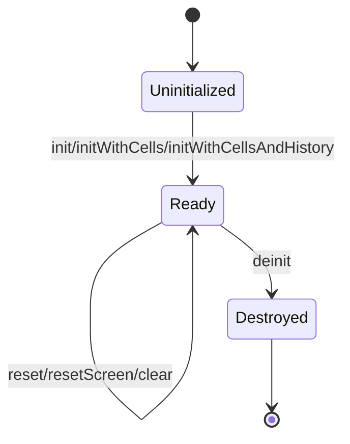
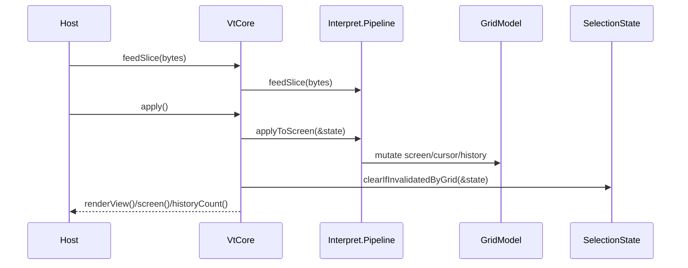
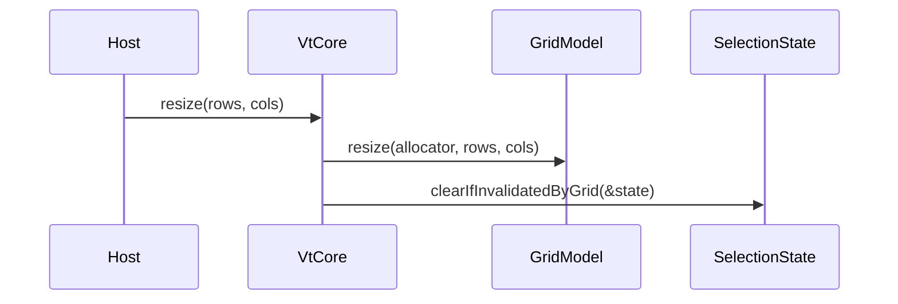

# Design

Shared rules: [`../design/design-rules.md`](../design/design-rules.md)

## Purpose
`howl-vt-core` owns the host-neutral terminal model.

It parses terminal input streams, interprets them into semantic actions, applies them to grid state, tracks selection and snapshot state, and exposes a stable render-facing view.

## Public Surface
- `VtCore`: main runtime owner.
- `Input`: input domain owner.
- `ParserApi`: parser domain owner.
- `Interpret`: interpret domain owner.
- `Grid`: grid domain owner.
- `Selection`: selection domain owner.
- `Snapshot`: snapshot domain owner.

## Ownership Rules
- `VtCore` owns lifecycle, parser pipeline ownership, grid state, and selection state.
- `Input` owns key, modifier, mouse, and input codec vocabulary.
- `ParserApi` owns byte-stream parsing contracts.
- `Interpret` owns parser-to-grid translation flow.
- `Grid` owns screen, cursor, and scrollback model state.
- `Selection` owns selection state and validity against grid mutations.
- `Snapshot` owns exported snapshot shapes only.

## Lifecycle

## Main Flows
### Parse And Apply

### Resize

## API Contracts
- `init*` returns an owned `VtCore`; caller must later call `deinit`.
- `feedByte` and `feedSlice` queue parser work only; they do not apply it to the grid.
- `apply` is the boundary that mutates screen state.
- `renderView` returns a stable read-only projection for rendering.
- `resize` preserves terminal semantics while updating visible geometry.
- Selection validity is rechecked after grid-affecting operations.

## Non-Goals
- PTY ownership.
- Host windowing.
- GPU rendering.
- Font loading or rasterization.

## Change Rules
- New visible-state concepts should either live on `VtCore` or in a clearly named sibling domain owner.
- Parser and interpret internals may change freely if the `VtCore` contract stays stable.
- Hosts should depend on `VtCore`, not deep parser/grid leaves.
